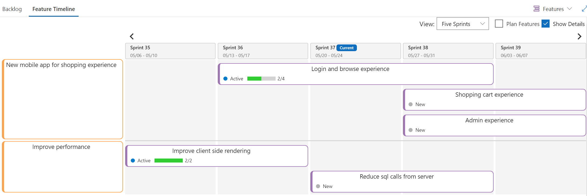

> **NOTE: This extension has been deprecated.** The code is still available but there will be no updates moving forward. Feel free to use the code as-is to build something on your own.

**Plan or track work items in progress by visualizing them on a sprint calendar**. 
Portfolio level work items are worked for multiple sprints and this tool helps you visualize features or epics across sprints, yes you heard it right, **cross sprint schedule**!!!




## Get started
**Warning**: The code was written as part of a Hackathon. And the code quality is of Hackathon :). The features were added too quickly and never got time to fix the engineering backlog.

Building and testing the extension requires following.

1) [Download and install nodejs](http://nodejs.org "nodejs")
2) [webpack](https://webpack.js.org/)
3) [tfx cli](https://docs.microsoft.com/en-us/vsts/extend/publish/command-line?view=vsts)
4) [TypeScript](https://www.typescriptlang.org/)
```
npm i -g typescript tfx-cli webpack-cli
```

Install dev prerequisites
```
npm install
```

### Create vsix to deploy on test environment
```
webpack && npm run package:dev:http
```
### Run the extension server locally
Execute following commands in two separate Command Prompts
```
webpack --watch
npm run dev:http
```
### Publish the dev extension to marketplace
Follow the instructions here

[Package, publish, unpublish, and install VSTS extensions
](https://docs.microsoft.com/en-us/vsts/extend/publish/overview?view=vsts)


# Contributing

This project welcomes contributions and suggestions.  Most contributions require you to agree to a
Contributor License Agreement (CLA) declaring that you have the right to, and actually do, grant us
the rights to use your contribution. For details, visit https://cla.microsoft.com.

When you submit a pull request, a CLA-bot will automatically determine whether you need to provide
a CLA and decorate the PR appropriately (e.g., label, comment). Simply follow the instructions
provided by the bot. You will only need to do this once across all repos using our CLA.

This project has adopted the [Microsoft Open Source Code of Conduct](https://opensource.microsoft.com/codeofconduct/).
For more information see the [Code of Conduct FAQ](https://opensource.microsoft.com/codeofconduct/faq/) or
contact [opencode@microsoft.com](mailto:opencode@microsoft.com) with any additional questions or comments.
